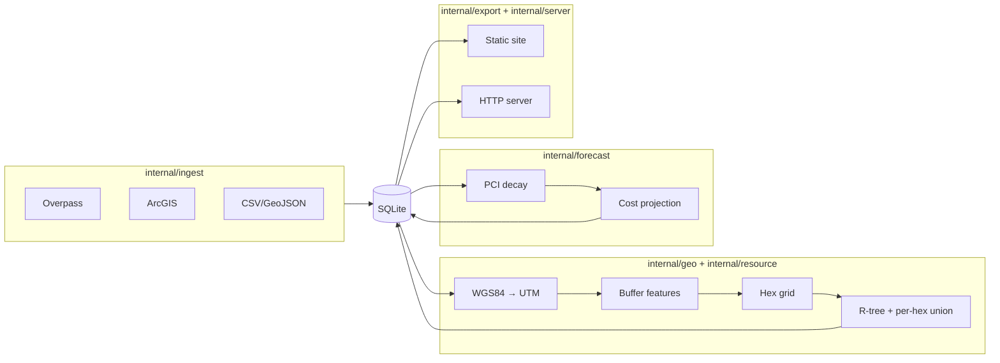
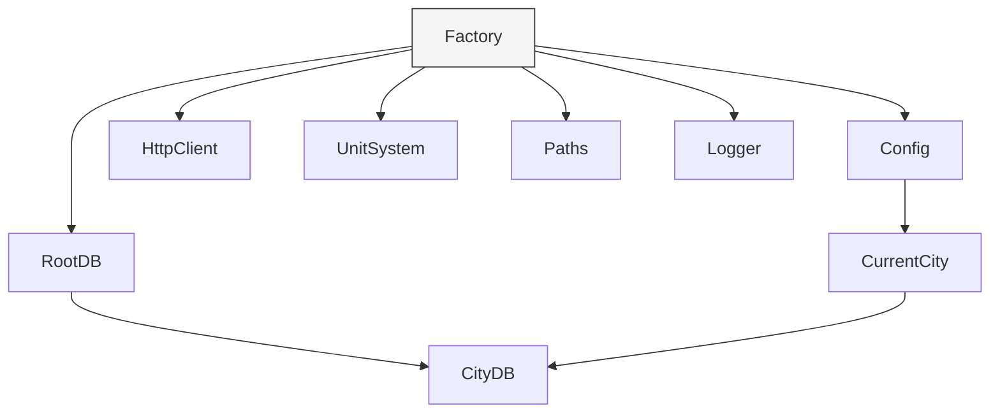
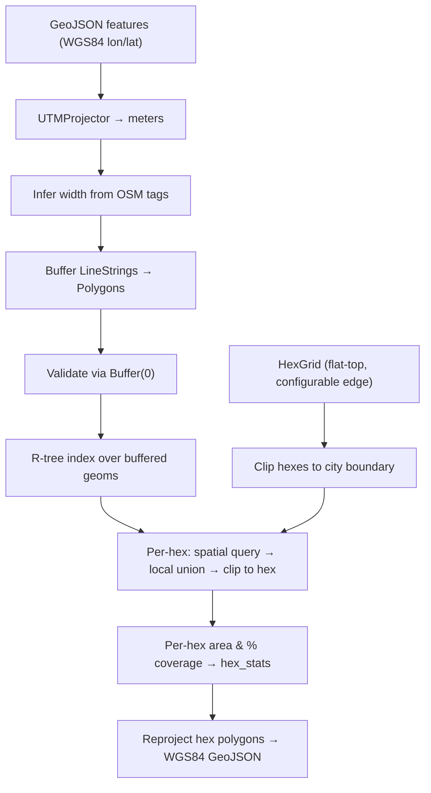
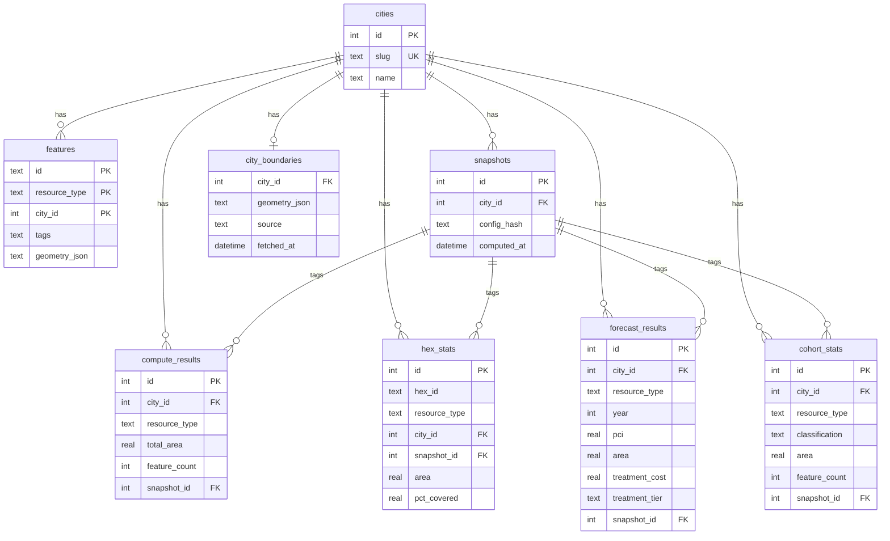

# Architecture

## Data pipeline

## Factory DI

Most dependencies are lazy-initialized behind `sync.OnceValues` closures in the `Factory` struct. The exception is `Logger`, which is constructed eagerly because its handler is cheap and the level is mutated through a shared `LogLevel *slog.LevelVar`.

Commands receive a `*Factory` and call only the accessors they need. The root command's `PersistentPreRunE` wires the `--city/-c` and `--units` flags into `CurrentCity` and `UnitSystem` before subcommands are added, so flag-aware overrides take precedence over per-city and top-level config. Multi-city commands use `cmdutil.ForEachCity`, which builds a city-scoped factory per iteration and silently skips cities with no results.

## Geometry pipeline

All area math happens in projected (meter) coordinates, never in degrees.

Roads: width inferred from `width` tag, `lanes` count, or classification defaults, plus parking lane addon.
Parking: polygons used directly.
Sidewalks: buffered like roads with sidewalk-specific width defaults.

## Database schema

Single file at `~/.local/share/pvmt/pvmt.db`. WAL mode. All tables scoped by `city_id`.

## Design decisions

**Metric internals.** All areas are stored in square meters. The `--units` flag and `[display].units` config control presentation only.

**Snapshots.** Each compute run creates a snapshot with a hash of the resolved config. Per-row `snapshot_id` columns on `hex_stats`, `compute_results`, `forecast_results`, and `cohort_stats` preserve every run's results — saves append rather than DELETE-then-INSERT, so historical snapshots stay queryable for reproducibility.

**WASM build order.** The forecast WASM binary is embedded via `go:embed`. It must be compiled (`make wasm`) before building the main binary. The Makefile enforces this dependency.

**HTTP caching.** API responses are disk-cached at `~/.cache/pvmt/http/` with a 24-hour TTL. Use `--force` on ingest to bypass.

**Overpass splitting.** Large Overpass queries auto-split into quadrants (up to depth 3 / 64 requests) and deduplicate at boundaries.

**Forecast model.** Exponential PCI decay: `PCI(t) = PCI_0 * exp(-k*t)`. Per-classification decay rates default to FHWA national averages. Costs are projected via configurable PCI-to-cost tiers. Pavement growth is modeled as linear annual increase.

**TUI progress (deviation from byob-progress.3).** `internal/tui` runs a single bubbletea `StepModel` that renders a phase checklist, log tail, warnings panel, and per-phase progress bar in one view. Spinner frames and the progress bar are inline rendering inside that model — not standalone widgets. The upstream byob recipe prescribes `bubbles/spinner` + `schollz/progressbar` wrapped behind a `Progress` interface; that fits a CLI with isolated, ad-hoc progress events but adds ceremony when the UI is already a unified bubbletea program. The hand-rolled approach is ~10 frames plus one render function with zero extra deps; revisit if the TUI grows beyond the checklist shape.
