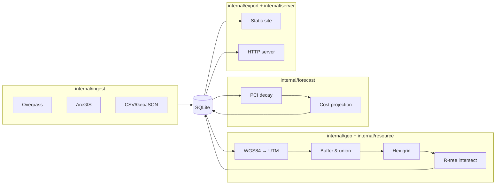
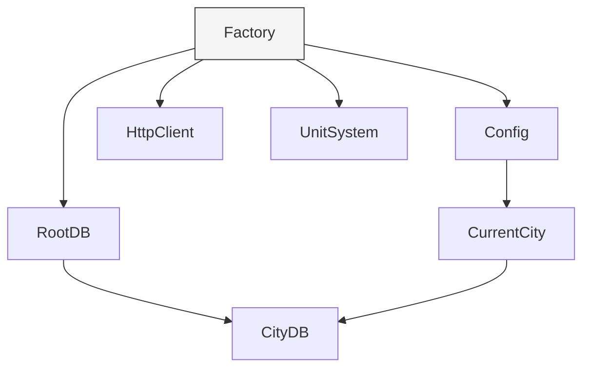
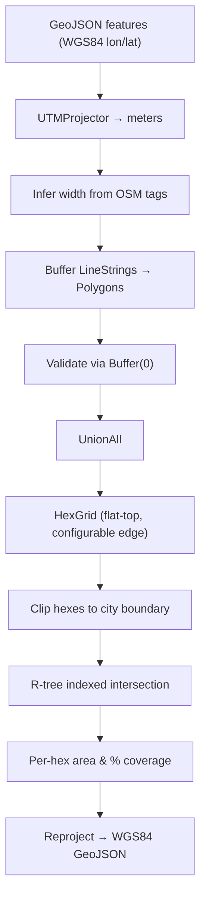
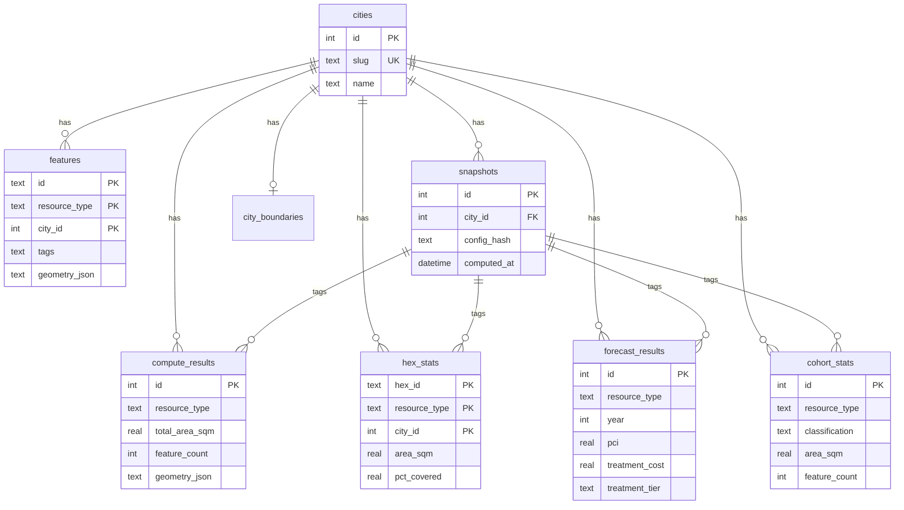

# Architecture

## Data pipeline

## Factory DI

All dependencies are lazy-initialized behind `sync.Once` closures in the `Factory` struct.

Commands receive a `*Factory` and call only the accessors they need. `--city` flag overrides `CurrentCity`. Multi-city commands use `ForEachCity` which creates a city-scoped factory per iteration.

## Geometry pipeline

All area math happens in projected (meter) coordinates, never in degrees.

Roads: width inferred from `width` tag, `lanes` count, or classification defaults, plus parking lane addon.
Parking: polygons used directly.
Sidewalks: buffered like roads with sidewalk-specific width defaults.

## Database schema

Single file at `~/.local/share/pvmt/pvmt.db`. WAL mode. All tables scoped by `city_id`.

## Design decisions

**Config discovery.** `pvmt.toml` is found by walking from the working directory upward to `/`. First match wins. Works from any subdirectory, like `.git`.

**Metric internals.** All areas are stored in square meters. The `--units` flag and `[display].units` config control presentation only.

**Snapshots.** Each compute run creates a snapshot with a hash of the resolved config. Results link back to their snapshot for reproducibility.

**WASM build order.** The forecast WASM binary is embedded via `go:embed`. It must be compiled (`make wasm`) before building the main binary. The Makefile enforces this dependency.

**HTTP caching.** API responses are disk-cached at `~/.cache/pvmt/http/` with a 24-hour TTL. Use `--force` on ingest to bypass.

**Overpass splitting.** Large Overpass queries auto-split into quadrants (up to depth 3 / 64 requests) and deduplicate at boundaries.

**Forecast model.** Exponential PCI decay: `PCI(t) = PCI_0 * exp(-k*t)`. Per-classification decay rates default to FHWA national averages. Costs are projected via configurable PCI-to-cost tiers. Pavement growth is modeled as linear annual increase.
