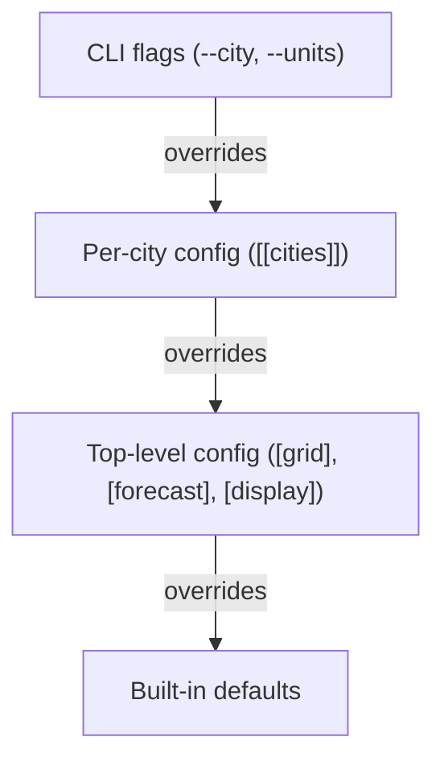

# Configuration

## Discovery

`pvmt.toml` is found by walking from the current working directory upward to `/`. First match wins. Put it at the project root and it works from any subdirectory.

If no file is found, pvmt exits with an error.

## Resolution hierarchy



Fields that support per-city override: `hex_edge_m`, all `[forecast]` fields (`decay_rate`, `growth_rate`, `years`, `cost_tiers`). Per-city forecast merges field-by-field — set only the fields you want to override.

Built-in defaults: hex edge 100m, forecast horizon 20 years, imperial display units.

## Multi-city

Each `[[cities]]` entry gets:

- An auto-generated slug (e.g., "Berkeley, CA" becomes `berkeley-ca`)
- Its own boundary polygon (fetched from Nominatim on first ingest)
- Its own features, compute results, hex stats, and forecasts — all scoped by `city_id` in the database

Without `--city`, commands run against all cities. With `--city "Berkeley, CA"` (matches by name or slug), they target one.

The web UI and export provide a city switcher when multiple cities are configured.

## Data sources

- `overpass = true` — enables OpenStreetMap Overpass API queries
- `arcgis_url = "https://..."` — enables ArcGIS FeatureServer queries (roads only)
- `[[layers]]` — local CSV or GeoJSON file ingest

Multiple sources can be enabled for the same city. Features are deduplicated by ID.

## Forecast tuning

**`decay_rate`** — the exponential decay coefficient *k* in `PCI(t) = PCI_0 * exp(-k*t)`. Higher values mean faster degradation. When set to 0 (default), per-classification rates are used (ranging from ~0.015 for motorways to ~0.045 for service roads).

**`growth_rate`** — annual linear growth of paved area. `0.01` = 1% per year.

**`years`** — forecast horizon. Default 20.

**`cost_tiers`** — maps PCI ranges to treatment cost per square meter. Costs are interpolated between tier midpoints, not step functions. Example:

```toml
[[forecast.cost_tiers]]
min_pci = 0
max_pci = 40
cost_per_sqm = 150.0
label = "Critical"
```

## Database location

`~/.local/share/pvmt/pvmt.db`. Single file for all cities. WAL mode for concurrent readers.
