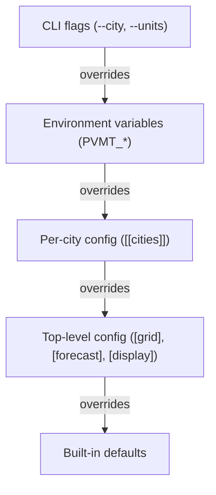

# Configuration

## Discovery

`pvmt.toml` is found by walking from the current working directory upward to `/`. First match wins. Put it at the project root and it works from any subdirectory.

If no file is found, pvmt exits with an error.

## Resolution hierarchy



Fields that support per-city override: `hex_edge_m`, `boundary_relation_id`, all `[forecast]` fields (`decay_rate`, `growth_rate`, `years`, `cost_tiers`). Per-city forecast merges field-by-field — set only the fields you want to override.

`boundary_relation_id` (default unset) names an OSM admin_level=8 relation to fetch from Overpass instead of the usual Nominatim search by name. Set it when ingest fails with `expected Polygon or MultiPolygon, got "Point"` — that means Nominatim has the city as a node rather than a relation, and the boundary is reachable only via Overpass. Find the relation ID with [Overpass Turbo](https://overpass-turbo.eu/): `relation["name"="<city>"]["boundary"="administrative"]["admin_level"="8"];out;`. A relation whose bbox spans more than 5° is rejected as a likely county/state typo.

Built-in defaults: hex edge 100m, forecast horizon 20 years, imperial display units.

To inspect what value won and where it came from, run `pvmt config show --sources`. It annotates each resolved value with its origin (`flag`, `env`, `file`, or `default`); `--json` emits the same data structured for scripts.

## Environment variables

Env vars override the file but lose to CLI flags. Unparseable or out-of-range values are ignored with a stderr warning and the next layer wins.

| Variable | Overrides |
|---|---|
| `PVMT_UNITS` | `[display].units` (`metric` or `imperial`) |
| `PVMT_HEX_EDGE_M` | `[grid].hex_edge_m` (positive float, meters) |
| `PVMT_FORECAST_YEARS` | `[forecast].years` (positive integer) |
| `PVMT_FORECAST_INITIAL_PCI` | `[forecast].initial_pci` (clamped to 0–100) |

## Multi-city

Each `[[cities]]` entry gets:

- An auto-generated slug (e.g., "Berkeley, CA" becomes `berkeley-ca`)
- Its own boundary polygon (fetched from Nominatim on first ingest)
- Its own features, compute results, hex stats, and forecasts — all scoped by `city_id` in the database

Without `--city`, commands run against all cities. With `--city "Berkeley, CA"` (matches by name or slug), they target one.

The web UI and export provide a city switcher when multiple cities are configured.

## Data sources

- `overpass = true` — enables OpenStreetMap Overpass API queries
- `arcgis_url = "https://..."` — enables ArcGIS FeatureServer queries (roads only)
- `[[layers]]` — local CSV or GeoJSON file ingest. Each entry takes `name`, `type` (`csv` or `geojson`), `path`, and `id_prop` (the property used as the feature ID). See [`examples/`](../examples/) for working configs.

Multiple sources can be enabled for the same city. Features are deduplicated by ID.

## Forecast tuning

**`decay_rate`** — the exponential decay coefficient (see [Architecture › Design decisions › Forecast model](architecture.md#design-decisions) for the equation). Higher values mean faster degradation. When set to 0 (default), per-classification rates are used (ranging from ~0.015 for motorways to ~0.045 for service roads).

**`growth_rate`** — annual linear growth of paved area. `0.01` = 1% per year.

**`years`** — forecast horizon. Default 20.

**`cost_tiers`** — maps PCI ranges to treatment cost per square meter. Costs are interpolated between tier midpoints, not step functions. Example:

```toml
[[forecast.cost_tiers]]
min_pci = 0
max_pci = 40
cost_per_sqm = 150.0
label = "Critical"
```

Cost values are calibration inputs, not measurements — the shipped defaults come from FHWA treatment-selection guidance and are continental-US averages. Start with the defaults and only override per city when local bid tabs differ materially. Because tiers interpolate linearly at tier midpoints (not step-wise), the forecast is less sensitive to any single tier's value than it looks; bulk shifts across tiers matter more than boundary tweaks.

## Export precision

`[export].coordinate_decimals` (default `6`) controls the precision of `[lon, lat]` floats in emitted hex GeoJSON. 6 decimals ≈ 11 cm — plenty for a city-scale heatmap, and 30–50% smaller per file than the legacy 7-decimal output. Set higher (e.g. 7 for ~1 cm) if a downstream consumer genuinely needs finer resolution, or lower (e.g. 5 for ~1 m) to squeeze further. Boundary GeoJSON is unaffected (it's stored raw from Nominatim and embedded as-is).

## HTTP caching

`pvmt serve` sets `Cache-Control: public, max-age=300` on every JSON / GeoJSON response (meta, hexgrid, scenarios, forecast, forecast seed, hex cost summary, boundary, snapshots). HTML, JavaScript, and the embedded WASM are returned without a `Cache-Control` header — clients fall back to their own heuristic caching. The 5-minute TTL is hard-coded; there is no flag to tune it. Restart the server to force a refresh sooner.

`pvmt export` writes plain files into the output directory and cannot set response headers. Caching is whatever the host applies: GitHub Pages serves with `Cache-Control: max-age=600`, S3/CloudFront and nginx use whatever you configure. If you re-export and re-publish, intermediate caches may keep serving the previous build until their TTL expires — invalidate at the CDN or bump a query-string fingerprint on the deploy if you need an immediate flip.
