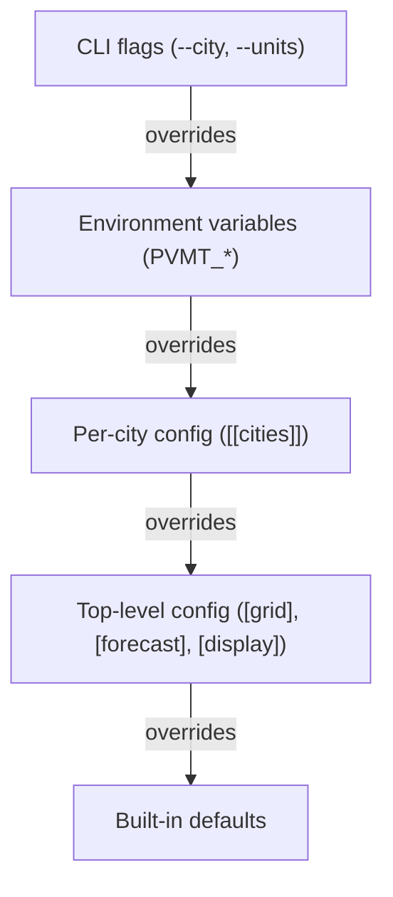

# Configuration

## Discovery

`pvmt.toml` is found by walking from the current working directory upward to `/`. First match wins. Put it at the project root and it works from any subdirectory.

If no file is found, pvmt exits with an error.

## Resolution hierarchy



Fields that support per-city override: `hex_edge_m`, `boundary_relation_id`, all `[forecast]` fields (`initial_pci`, `decay_rate`, `growth_rate`, `years`, `cost_tiers`, `current_budget`, `treatment_cycle_years`). Per-city forecast merges field-by-field — set only the fields you want to override.

`boundary_relation_id` (default unset) names an OSM admin_level=8 relation to fetch from Overpass instead of the usual Nominatim search by name. Set it when ingest fails with `nominatim returned no Polygon/MultiPolygon result for "<city>" (set [[cities]].boundary_relation_id to fetch the admin boundary from Overpass)` — that means Nominatim has the city as a node rather than a relation, and the boundary is reachable only via Overpass. Find the relation ID with [Overpass Turbo](https://overpass-turbo.eu/): `relation["name"="<city>"]["boundary"="administrative"]["admin_level"="8"];out;`. A relation whose bbox spans more than 5° is rejected as a likely county/state typo.

Built-in defaults: hex edge 100m, forecast horizon 20 years, imperial display units.

To inspect what value won and where it came from, run `pvmt config show --sources`. It annotates each resolved value with its origin (`flag`, `env`, `file`, or `default`); `--json` emits the same data structured for scripts.

## Environment variables

Env vars override the file but lose to CLI flags. Unparseable or out-of-range values are ignored with a stderr warning and the next layer wins.

| Variable | Overrides |
|---|---|
| `PVMT_UNITS` | `[display].units` (`metric` or `imperial`) |
| `PVMT_HEX_EDGE_M` | `[grid].hex_edge_m` (positive float, meters) |
| `PVMT_FORECAST_YEARS` | `[forecast].years` (positive integer) |
| `PVMT_FORECAST_INITIAL_PCI` | `[forecast].initial_pci` (must be in (0, 100]; out-of-range ignored with a stderr warning, next layer wins) |

## Multi-city

Each `[[cities]]` entry gets:

- An auto-generated slug (e.g., "Berkeley, CA" becomes `berkeley-ca`)
- Its own boundary polygon (fetched from Nominatim on first ingest)
- Its own features, compute results, hex stats, and forecasts — all scoped by `city_id` in the database

Without `--city`, commands run against all cities. With `--city "Berkeley, CA"` (matches by name or slug), they target one.

The web UI and export provide a city switcher when multiple cities are configured.

## Config identity (`config_id`)

`cities` rows in the local database are keyed by `(slug, config_id)`. This separates two configs that happen to define the same city — e.g. `examples/livermore-ca/pvmt.toml` and `examples/bay-area-ca/pvmt.toml` both defining "Livermore, CA" — so features, snapshots, and forecasts written under one don't clobber the other.

`config_id` is optional. When omitted, it defaults to the 16-character sha256 prefix of the config's absolute filesystem path. That default works out of the box for single-config users and disambiguates multi-example setups on a single machine.

Set `config_id` explicitly at the top of `pvmt.toml` if you need a stable key:

```toml
config_id = "austin-tx"

[[cities]]
name = "Austin, TX"
```

A user-set `config_id` is stable across:

- Renaming or moving the config file (the default hash would change and orphan the old row).
- Sharing the local database (`~/.local/share/pvmt/pvmt.db`) with a collaborator (the default hash encodes the source machine's `$HOME` indirectly).
- Symlinks and case-insensitive filesystems that would produce different absolute paths for the same file.

Two configs that both set `config_id = "same"` while defining a city with the same slug will collide — that is the keying-collision the field is designed to prevent, so pick distinct values.

## Data sources

- `overpass = true` — enables OpenStreetMap Overpass API queries
- `arcgis_url = "https://..."` — enables ArcGIS FeatureServer queries (roads only). Add `allow_private_arcgis = true` alongside it to reach a self-hosted or staging endpoint on a private/loopback address; public endpoints don't need it and shouldn't set it.

Multiple sources can be enabled for the same city. Features are deduplicated by ID.

## Forecast tuning

**`initial_pci`** — the starting Pavement Condition Index (PCI) the forecast assumes for every segment, on a 0–100 scale. Must be in `(0, 100]`; an unset, zero, or out-of-range value falls back to the default `85`. Also settable via the `PVMT_FORECAST_INITIAL_PCI` env var (see [Environment variables](#environment-variables)).

**`decay_rate`** — the exponential decay coefficient (see [Architecture › Design decisions › Forecast model](architecture.md#design-decisions) for the equation). Higher values mean faster degradation. When set to 0 (default), per-classification rates are used (ranging from ~0.015 for motorways to ~0.045 for service roads).

**`growth_rate`** — annual linear growth of paved area. `0.01` = 1% per year. Negative values (shrinking network) are accepted. Note: a per-city `growth_rate` of exactly `0` is indistinguishable from "unset" and is therefore treated as no override — a city cannot use `0` to opt out of a positive top-level rate; omit the top-level rate instead.

**`years`** — forecast horizon. Default 20.

**`cost_tiers`** — maps PCI ranges to treatment cost per square meter. Costs are interpolated between tier midpoints, not step functions. Example:

```toml
[[forecast.cost_tiers]]
min_pci = 0
max_pci = 40
cost_per_sqm = 150.0
label = "Critical"
```

Cost values are calibration inputs, not measurements — the shipped defaults are 2024 median urban municipal bid prices (preventive-treatment costs stay near FHWA ranges). Start with the defaults and only override per city when local bid tabs differ materially. Because tiers interpolate linearly at tier midpoints (not step-wise), the forecast is less sensitive to any single tier's value than it looks; bulk shifts across tiers matter more than boundary tweaks.

**`current_budget`** — the city's annual pavement-repair budget, in dollars. There is no default: when unset (or `0`), the budget-dependent solvency metrics — `insolvency_year` and `funding_gap` — are disabled for that city, and the export omits them rather than reporting figures against a fabricated `$0`. (The `break_even_budget` metric is always computed for roads and does not depend on this field.) Set it to a cited figure to surface the headline solvency numbers.

**`treatment_cycle_years`** — the pavement treatment cycle N, in years. The model assumes ~1/N of the network is scheduled for treatment each year, so the annual need is the full-network retreatment cost ÷ N. Default 12 (the midpoint of the typical 10–14 yr municipal cycle). This directly scales `break_even_budget` (∝ 1/N) and sets the `insolvency_year` threshold, so it is the main lever for matching the solvency dollars to a city's actual program. A value of `1` reproduces the legacy behavior (the entire network priced every year, which overstates the hold-steady budget — see [architecture.md](architecture.md) "Solvency methodology" and `docs/validation.md` §5). Allowed range 1–40; `0`/unset uses the default.

## Display

`[display].min_hex_area` (square meters, default `100`) drops boundary-sliver hexes below that area from the heatmap, so partial edge cells don't skew the map or the per-hex stats. `[display].units` is covered under [Resolution hierarchy](#resolution-hierarchy).

## Export

`[export].title` sets the region name headlining the multi-city landing page of an exported site; when unset it falls back to the output directory's base name.

`[export].coordinate_decimals` (default `6`) controls the precision of `[lon, lat]` floats in emitted hex GeoJSON. 6 decimals ≈ 11 cm — plenty for a city-scale heatmap. Set higher (e.g. 7 for ~1 cm) if a downstream consumer genuinely needs finer resolution, or lower (e.g. 5 for ~1 m) to squeeze further. Boundary GeoJSON is unaffected (it's stored raw from Nominatim and embedded as-is).

## HTTP caching

`pvmt serve` sets `Cache-Control: public, max-age=300` on every JSON / GeoJSON response (meta, hexgrid, scenarios, forecast, forecast seed, hex cost summary, boundary, snapshots). HTML, JavaScript, and the embedded WASM are returned without a `Cache-Control` header — clients fall back to their own heuristic caching. The 5-minute TTL is hard-coded; there is no flag to tune it. Restart the server to force a refresh sooner.

`pvmt export` writes plain files into the output directory and cannot set response headers. Caching is whatever the host applies: GitHub Pages serves with `Cache-Control: max-age=600`, S3/CloudFront and nginx use whatever you configure. If you re-export and re-publish, intermediate caches may keep serving the previous build until their TTL expires — invalidate at the CDN or bump a query-string fingerprint on the deploy if you need an immediate flip.
