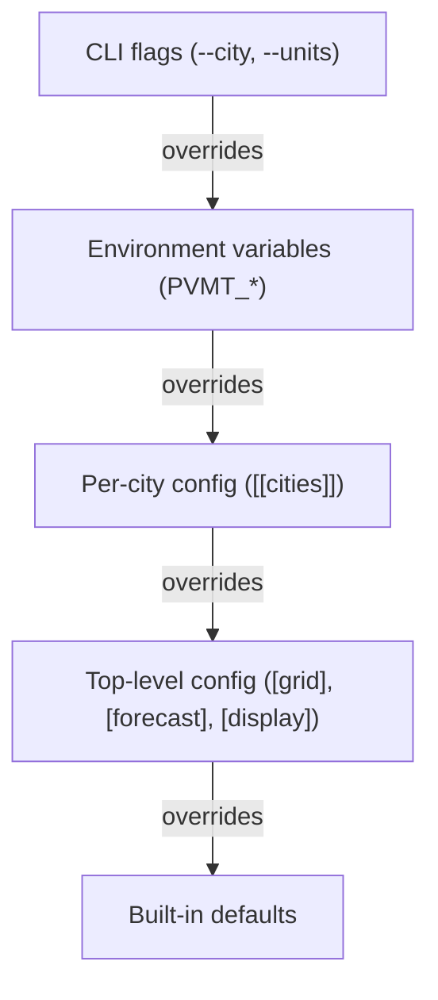

# Configuration

## Discovery

`pvmt.toml` is found by walking from the current working directory upward to `/`. First match wins. Put it at the project root and it works from any subdirectory.

If no file is found, pvmt exits with an error.

## Resolution hierarchy


```mermaid
flowchart TD
    CLI["CLI flags (--city, --units)"]
    Env["Environment variables (PVMT_*)"]
    City["Per-city config ([[cities]])"]
    Top["Top-level config ([grid], [forecast], [display])"]
    Default["Built-in defaults"]

    CLI -->|overrides| Env -->|overrides| City -->|overrides| Top -->|overrides| Default
```

Fields that support per-city override: `hex_edge_m`, `min_hex_area`, `boundary_relation_id`, all `[forecast]` fields (`initial_pci`, `decay_rate`, `growth_rate`, `years`, `cost_tiers`, `current_budget`, `treatment_cycle_years`). Per-city forecast merges field-by-field — set only the fields you want to override.

`boundary_relation_id` (default unset) names an OSM admin_level=8 relation to fetch from Overpass instead of the usual Nominatim search by name. Set it when ingest fails with `nominatim returned no Polygon/MultiPolygon result for "<city>" (set [[cities]].boundary_relation_id to fetch the admin boundary from Overpass)` — that means Nominatim has the city as a node rather than a relation, and the boundary is reachable only via Overpass. Find the relation ID with [Overpass Turbo](https://overpass-turbo.eu/): `relation["name"="<city>"]["boundary"="administrative"]["admin_level"="8"];out;`. A relation whose bbox spans more than 5° is rejected as a likely county/state typo.

Built-in defaults: hex edge 100m, forecast horizon 20 years, imperial display units.

To inspect what value won and where it came from, run `pvmt config show --sources`. It annotates each resolved value with its origin (`flag`, `env`, `file`, or `default`); `--json` emits the same data structured for scripts.

## Environment variables

Env vars override the file but lose to CLI flags. Unparseable or out-of-range values are ignored with a stderr warning and the next layer wins.

| Variable | Overrides |
|---|---|
| `PVMT_UNITS` | `[display].units` (`metric` or `imperial`) |
| `PVMT_HEX_EDGE_M` | `[grid].hex_edge_m` (positive float, meters) |
| `PVMT_FORECAST_YEARS` | `[forecast].years` (positive integer) |
| `PVMT_FORECAST_INITIAL_PCI` | `[forecast].initial_pci` (must be in (0, 100]; out-of-range ignored with a stderr warning, next layer wins) |

## Multi-city

Each `[[cities]]` entry gets:

- An auto-generated slug (e.g., "Berkeley, CA" becomes `berkeley-ca`)
- Its own boundary polygon (fetched from Nominatim on first ingest)
- Its own features, compute results, hex stats, and forecasts — all scoped by `city_id` in the database

Without `--city`, commands run against all cities. With `--city "Berkeley, CA"` (matches by name or slug), they target one.

The web UI and export provide a city switcher when multiple cities are configured.

## Tags (grouping cities)

Give a city one or more `tags` to group it in the city selector and to scope the Compare and Aggregate tabs:

```toml
[[cities]]
name = "San Jose, CA"
tags = ["Bay Area", "Top 50"]
```

- The city selector renders one `<optgroup>` per tag; a city with several tags appears under each. Cities with no tags fall into an ungrouped "Other" group.
- The dashboard's `#tag-scope` selector filters the Compare and Aggregate tabs to a single tag ("All cities" restores the global rollup). This is independent of the city-vs-all-jurisdiction scope toggle. The active tag is recorded in the URL as `?tag=`, so a filtered view is shareable and survives back/forward.
- Tag labels must be non-blank; an empty string is rejected at load rather than silently grouping the city as untagged.

Tags are often assigned at the `[[include]]` site (below) rather than per city, so a city pulled in by several includes accumulates the union of their tags automatically.

### Migrating from `region`

`tags` replaces the older single-valued `region` key. Unknown keys are a hard error, so a config still carrying `region = "…"` fails at load with `unknown config key(s): cities.region` — replace it with `tags = ["…"]`. The rename also flips the published `cities.json` and the `/api/cities` response from `region` to `tags`, so any external consumer reading `region` needs the same change.

## Including other configs (`[[include]]`)

`[[include]]` merges the cities from other `pvmt.toml` files into one config, tagging each pulled-in city at the include site. This is how `examples/all/pvmt.toml` unions every example into a single tagged site without duplicating any `[[cities]]`:

```toml
[export]
title = "Solvent Streets"

[[include]]
path = "../bay-area-ca/pvmt.toml"
tags = ["Bay Area"]

[[include]]
path = "../top-50-cities/pvmt.toml"
tags = ["Top 50"]
```

- `path` is resolved relative to the including file's directory (absolute paths are used as-is).
- Cities are merged by slug. A city reached through several includes is merged **once** with the **union** of the includes' (and its own) tags — so San Jose, present in both the Bay Area and Top 50 lists, ends up tagged `["Bay Area", "Top 50"]`.
- Two **different** city names that slugify to the same value are a hard error (rather than silently dropping one). Cities with the **same** name across includes are the intended overlap.
- Calibration merges **per field**, not per block. For each of `hex_edge_m`, `min_hex_area` and every field of `[forecast]` (including `cost_tiers`), the **first** include to *set* the field wins it, and later includes fill only the fields it left **unset**. So a city in both a metro example and a broad national list keeps the metro's local grid and decay tuning *and* gains the national list's cited `initial_pci` and `current_budget` — no city ends up calibrated worse than either input file. Order includes so the more specific (metro) config comes first; that is what decides the winner, not the file's contents.
- When two includes both set the same field to *different* values, the first still wins and the load prints one `warning:` line per affected city naming the city, each contested field with both values, and both include paths. A field only one side sets is a backfill, not a disagreement, and is silent; identical values are silent too. Silence means nothing was dropped. `examples/all` currently warns about 12 cities, mostly `hex_edge_m` and `forecast.years` disagreements between a metro example and `top-50-cities`.
- The warnings are printed when a command actually reads the config, so `pvmt --version`, `pvmt cache prune` and other config-free commands stay silent and never pay for config discovery.
- Each included example's per-metro calibration (decay/growth/cost tiers, hex edge, min hex area) is flattened into fully self-describing per-city overrides during the merge. The including file must keep its top-level `[grid]`/`[forecast]` **and** `[display].min_hex_area` **empty** — a value there would re-calibrate any city that had relied on a package default, so it is rejected at load. The rest of `[display]` and `[export]` (`units`, `title`, …) is fine in the parent: those have no per-city layer. Set calibration per city or per example instead.
- A file that declares `[[include]]` may omit `[[cities]]` of its own; the "at least one city" requirement is enforced after the merge.
- Editing any included file changes the merged config's identity hash, so snapshots invalidate and `pvmt compute` reruns as expected.

## Config identity (`config_id`)

`cities` rows in the local database are keyed by `(slug, config_id)`. This separates two configs that happen to define the same city — e.g. `examples/livermore-ca/pvmt.toml` and `examples/bay-area-ca/pvmt.toml` both defining "Livermore, CA" — so features, snapshots, and forecasts written under one don't clobber the other.

**`[[include]]` is the exception, deliberately.** Two files that merely happen to share a slug are unrelated; an included file's city *is* that file's city. So a city pulled in through `[[include]]` keeps its source config's `config_id` **and** its source config's content hash, and resolves to the same row and the same snapshots as if you had run `pvmt` from that example's own directory. That is what lets a union config like `examples/all` read data it never ingested. It also means ingest, compute and forecast run from the union write *into* the source examples' namespaces rather than a namespace of their own — see [examples/all](../examples/all/pvmt.toml).

One divergence the merge can introduce is worth knowing about, because it is caught rather than tolerated: calibration merges per field with first-to-set winning, so a union can resolve a different `hex_edge_m` for a city than the config that computed it. Hex ids are derived from the grid, so that would silently export a blank map. The exporter compares the two and fails with a hint instead.

`config_id` is optional. When omitted, it defaults to the 16-character sha256 prefix of the config's absolute filesystem path. That default works out of the box for single-config users and disambiguates multi-example setups on a single machine.

Set `config_id` explicitly at the top of `pvmt.toml` if you need a stable key:

```toml
config_id = "austin-tx"

[[cities]]
name = "Austin, TX"
```

A user-set `config_id` is stable across:

- Renaming or moving the config file (the default hash would change and orphan the old row).
- Sharing the local database (`~/.local/share/pvmt/pvmt.db`) with a collaborator (the default hash encodes the source machine's `$HOME` indirectly).
- Symlinks and case-insensitive filesystems that would produce different absolute paths for the same file.

Two configs that both set `config_id = "same"` while defining a city with the same slug will collide — that is the keying-collision the field is designed to prevent, so pick distinct values.

## Data sources

- `overpass = true` — enables OpenStreetMap Overpass API queries
- `arcgis_url = "https://..."` — enables ArcGIS FeatureServer queries (roads only). Add `allow_private_arcgis = true` alongside it to reach a self-hosted or staging endpoint on a private/loopback address; public endpoints don't need it and shouldn't set it.

Multiple sources can be enabled for the same city. Features are deduplicated by ID.

## Forecast tuning

**`initial_pci`** — the starting Pavement Condition Index (PCI) the forecast assumes for every segment, on a 0–100 scale. Must be in `(0, 100]`; an unset, zero, or out-of-range value falls back to the default `85`. Also settable via the `PVMT_FORECAST_INITIAL_PCI` env var (see [Environment variables](#environment-variables)). This is the network *average*: internally the forecast spreads it into a condition **distribution** (a Beta around this mean, preserved exactly) before pricing, so the cost figures reflect the failed/poor tail rather than the average alone (see `docs/validation.md` §4). No configuration is needed — the spread is always on; setting a realistic average for your network is the lever.

**`decay_rate`** — the exponential decay coefficient (see [Architecture › Design decisions › Forecast model](architecture.md#design-decisions) for the equation). Higher values mean faster degradation. When set to 0 (default), per-classification rates are used (ranging from ~0.015 for motorways to ~0.045 for service roads).

**`growth_rate`** — annual linear growth of paved area. `0.01` = 1% per year. Negative values (shrinking network) are accepted. Note: a per-city `growth_rate` of exactly `0` is indistinguishable from "unset" and is therefore treated as no override — a city cannot use `0` to opt out of a positive top-level rate; omit the top-level rate instead.

**`years`** — forecast horizon. Default 20.

**`cost_tiers`** — maps PCI ranges to treatment cost per square meter. Costs are interpolated between tier midpoints, not step functions. Example:

```toml
[[forecast.cost_tiers]]
min_pci = 0
max_pci = 40
cost_per_sqm = 150.0
label = "Critical"
```

Cost values are calibration inputs, not measurements — the shipped defaults are 2024 median urban municipal bid prices (preventive-treatment costs stay near FHWA ranges). Start with the defaults and only override per city when local bid tabs differ materially. Because tiers interpolate linearly at tier midpoints (not step-wise), the forecast is less sensitive to any single tier's value than it looks; bulk shifts across tiers matter more than boundary tweaks.

**`current_budget`** — the city's annual pavement-repair budget, in dollars. There is no default: when unset (or `0`), the budget-dependent solvency metrics — `insolvency_year` and `funding_gap` — are disabled for that city, and the export omits them rather than reporting figures against a fabricated `$0`. (The `break_even_budget` metric is always computed for roads and does not depend on this field.) Set it to a cited figure to surface the headline solvency numbers.

**`treatment_cycle_years`** — the pavement treatment cycle N, in years. The model assumes ~1/N of the network is scheduled for treatment each year, so the annual need is the full-network retreatment cost ÷ N. Default 12 (the midpoint of the typical 10–14 yr municipal cycle). This directly scales `break_even_budget` (∝ 1/N) and sets the `insolvency_year` threshold, so it is the main lever for matching the solvency dollars to a city's actual program. A value of `1` reproduces the legacy behavior (the entire network priced every year, which overstates the hold-steady budget — see [architecture.md](architecture.md) "Solvency methodology" and `docs/validation.md` §5). Allowed range 1–40; `0`/unset uses the default.

## Display

`[display].min_hex_area` (square meters, default `100`) drops boundary-sliver hexes below that area from the heatmap, so partial edge cells don't skew the map or the per-hex stats. It is coupled to `hex_edge_m` — a finer grid wants a smaller threshold — so it can also be set per city (`[[cities]].min_hex_area`), which wins over the top-level value; `0`/unset inherits. The per-city form is what an `[[include]]` flattens, so an included example's tuned threshold survives the merge alongside its hex edge; for the same reason a file that declares `[[include]]` may not set the top-level form at all (see [Including other configs](#including-other-configs-include)). Mind the coupling when tuning: a threshold larger than a full hex (`3√3/2 · edge²`, so ~9.4k m² at a 60 m edge) drops **every** hex and renders a blank map. It applies to both the heatmap and the `/play` board, which share one hex grid.

`[display].units` is covered under [Resolution hierarchy](#resolution-hierarchy).

## Export

`[export].title` sets the name headlining a multi-city exported dashboard; when unset it falls back to the output directory's base name. Only the top-level config's title is used — a title set in a file pulled in via `[[include]]` is discarded along with the rest of its non-`[[cities]]` settings.

`[export].coordinate_decimals` (default `6`) controls the precision of `[lon, lat]` floats in emitted GeoJSON — both the hex grid and the display boundary. 6 decimals ≈ 11 cm — plenty for a city-scale heatmap. Set higher (e.g. 7 for ~1 cm) if a downstream consumer genuinely needs finer resolution, or lower (e.g. 5 for ~1 m) to squeeze further.

`[export].boundary_simplify_m` (default `10`) is the [Ramer–Douglas–Peucker](https://en.wikipedia.org/wiki/Ramer%E2%80%93Douglas%E2%80%93Peucker_algorithm) tolerance, in meters, applied to the **display** copy of the city boundary — what `boundary.geojson` contains and what `/data/boundary.geojson` serves. Nominatim boundaries carry far more detail than a dashed outline at city zoom can resolve (Jacksonville is 205,961 coordinate pairs across 7,371 rings), so the default retains roughly a quarter of the vertices for about a 0.15% change in enclosed area. Raise it to squeeze further at visible cost to the outline; set it **negative** to opt out entirely, which emits the stored GeoJSON byte-for-byte. Values above `1000` are rejected, as are `nan` and `inf`.

This affects display only. The **authoritative** boundary is never simplified: hex clipping, the `city` coverage scope, and the `City Area` / `% Paved` figures in `meta.json` all read the stored polygon directly. One visible consequence is that at high zoom, hexes clipped to the real boundary can overhang the drawn outline by up to the tolerance. Simplified rings are also not guaranteed to be valid polygons — RDP can make a ring self-intersect, which is invisible on the line layer the client draws but would matter to a downstream consumer filling them.

## HTTP caching

`pvmt serve` sets `Cache-Control: public, max-age=300` on every JSON / GeoJSON response (meta, hexgrid, scenarios, forecast, forecast seed, hex cost summary, boundary, snapshots). HTML, JavaScript, and the embedded WASM are returned without a `Cache-Control` header — clients fall back to their own heuristic caching. The 5-minute TTL is hard-coded; there is no flag to tune it. Restart the server to force a refresh sooner.

The *outbound* request cache — the disk cache of Overpass / ArcGIS / Nominatim responses under `~/.cache/pvmt/http` — is deliberately not configurable from `pvmt.toml`. Its 24-hour TTL is a constant, and its size and age ceilings are flags on `pvmt cache prune` (`--max-age`, `--max-size`) rather than config keys: the cache is global and shared across every city and every project directory, so it does not belong to any one config file, and reclaiming disk has to work even when the config is unparseable. See [Troubleshooting › Disk usage](troubleshooting.md#disk-usage-the-http-cache-keeps-growing).

`pvmt export` writes plain files into the output directory and cannot set response headers. Caching is whatever the host applies: GitHub Pages serves with `Cache-Control: max-age=600`, S3/CloudFront and nginx use whatever you configure. If you re-export and re-publish, intermediate caches may keep serving the previous build until their TTL expires — invalidate at the CDN or bump a query-string fingerprint on the deploy if you need an immediate flip.
